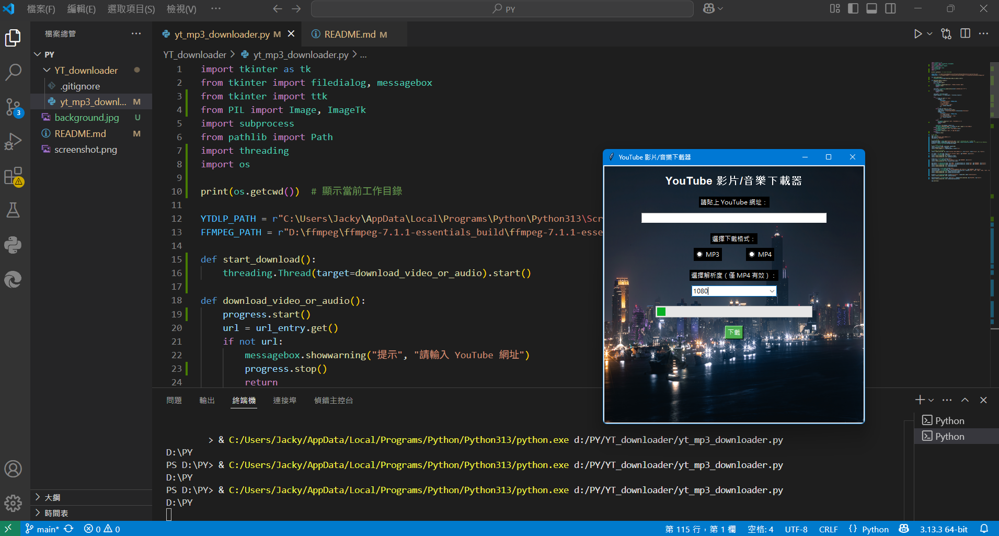

# YouTube MP3/MP4 Downloader 🎵

一個使用 Python、Tkinter 與 yt-dlp 製作的 YouTube 音訊/影片下載器。  
支援 MP3 音訊與 MP4 影片下載，可選擇解析度與儲存路徑，簡單直覺，適合自用與教學示範。

---

## 📦 使用技術

- Python 3.x
- Tkinter GUI
- [yt-dlp](https://github.com/yt-dlp/yt-dlp)
- subprocess 模組呼叫 yt-dlp
- pathlib 處理儲存路徑與輸出檔名

---

## 🌟 功能特色

- ✅ 支援 MP3 音訊下載
- ✅ 支援 MP4 影片下載（解析度可選）
- ✅ 自訂儲存資料夾與檔名格式
- ✅ 簡易 GUI 操作介面（不需終端機）

---

## 🚀 如何使用

1. 安裝 Python 套件（建議使用 virtualenv）：
   ```bash
   pip install yt-dlp
2. 執行主程式：
   ```bash
   python yt_mp3_downloader.py
3. 操作流程：
   - 貼上 YouTube 網址
   - 選擇下載格式（MP3 或 MP4）
   - 若為 MP4 可選解析度（如 720p）
   - 點擊「下載」開始執行

## 🖼️ 畫面預覽

> 主程式介面（YouTube 下載器 GUI）：




📄 License
本專案採用 MIT 授權條款。
可自由使用、修改與分享，僅供學習與個人用途，請勿用於商業盜版用途。
